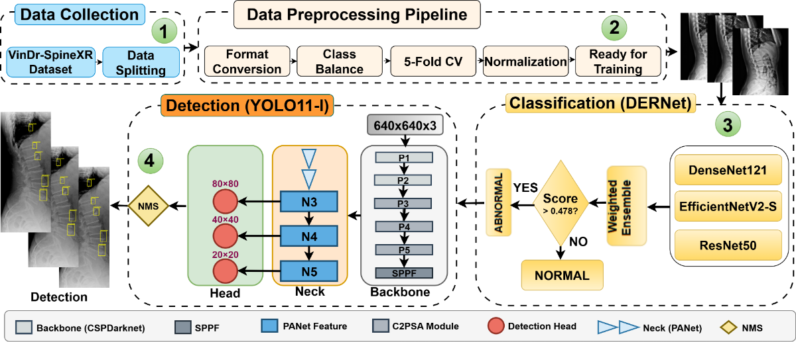

# DERNet: Unified Framework for Spinal Lesion Analysis

[](https://cimilab.github.io/DERNet/)
[](#)
[](http://creativecommons.org/licenses/by-sa/4.0/)

**A Cascaded DERNet and YOLO11 Framework for Spinal Lesion Triage and Localization**

## 📄 Abstract
Automated analysis of spinal radiographs is critical for early diagnosis but is often limited by severe class imbalance and the visual subtlety of lesions. **DERNet** introduces a novel dual-stage framework:
1.  **Triage (Classification):** An ensemble of DenseNet121, EfficientNetV2-S, and ResNet50 for highly sensitive binary classification.
2.  **Localization (Detection):** A YOLO11-L model for precise lesion detection and localization.

Our approach addresses the sensitivity-specificity trade-off and effectively captures fine-grained features of spinal pathologies. Validated on the **VinDr-SpineXR** benchmark, DERNet achieves state-of-the-art performance, bridging the gap between automated analysis and clinical deployment.

---

## 🚀 Key Contributions

*   **Dual-Stage Cascaded Architecture:** A novel framework combining a high-sensitivity triage ensemble with a high-precision YOLO11-L detector.
*   **Triage Ensemble:** Weighted fusion of **DenseNet-121 (0.38)**, **EfficientNetV2-S (0.36)**, and **ResNet-50 (0.26)** utilizing Test-Time Augmentation (TTA).
*   **Advanced Localization:** **YOLO11-L** optimized with C2PSA attention modules, SPPF, and a decoupled head for small object detection.
*   **Robust Imbalance Handling:** Implementation of **Copy-Paste Augmentation**, **Focal Loss**, and **Class-Aware Sampling** to address limit-case class imbalances (up to 46.9:1).
*   **Validated Performance:** Statistically significant improvement over baselines (p < 0.05) with **90.67% AUROC** in classification and **41.2% mAP@0.5** in detection.
*   **Explainable AI:** Integrated with LIME and Grad-CAM for transparent clinical decision support.
*   **Resources:** A fully reproducible framework specifically engineered to operate efficiently within low-resource and controlled environments.

---

## 📊 Performance

### Classification (5-Fold Cross-Validation)
| Model | AUROC (%) | Sensitivity (%) | Specificity (%) | F1-Score (%) |
| :--- | :---: | :---: | :---: | :---: |
| DenseNet-121 | 90.25 | 83.32 | 82.34 | 82.46 |
| EfficientNetV2-S | 89.44 | 70.80 | 91.12 | 79.34 |
| ResNet-50 | 88.88 | 82.72 | 78.13 | 80.15 |
| **DERNet Ensemble** | **90.67** | **84.58** | **84.12** | **83.21** |

### Detection (YOLO11-L)
*   **mAP@0.5:** **41.2% ± 0.3%** (vs. baseline 33.15%)
*   **mAP@0.5:0.95:** 20.1% ± 0.2%
*   **Precision:** 49.8% ± 0.5%
*   **Recall:** 40.5% ± 0.4%
*   **Inference Speed:** ~92ms per image (11 FPS) on RTX 3050

### Comparison with Baselines
| Method | Task | Key Metric | Our Result | Baseline | Improvement | p-value |
| :--- | :--- | :--- | :---: | :---: | :---: | :---: |
| VinDr Paper | Classification | AUROC | **90.67%** | 88.61% | +2.06% | <0.001 |
| VinDr Paper | Classification | Specificity | **84.12%** | 79.32% | +4.80% | <0.001 |
| RT-DETR-l | Detection | mAP@0.5 | **41.2%** | 25.68% | +60.4% | <0.001 |
| Paper Baseline | Detection | mAP@0.5 | **41.2%** | 33.15% | +24.3% | <0.001 |

---

## 🏥 Targeted Pathologies
The framework detects and localizes 7 distinct spinal lesions:
1.  Vertebral Collapse
2.  Osteophytes
3.  Spondylolisthesis
4.  Surgical Implant
5.  Disc Space Narrowing
6.  Foraminal Stenosis
7.  Other Lesions

---

## 🔬 Technical Methodology

### 1. Dataset & Preprocessing
Utilizing the **VinDr-SpineXR** dataset (8,389 images), we address class imbalance (46.9:1 ratio) through:
*   **CLAHE** and adaptive normalization.
*   **Copy-Paste Augmentation** (p=0.2) for minority classes.
*   **Geometric Augmentations:** Rotation (±15°), Flip, Mosaic (epochs 1-30).

### 2. Triage Stage (Classification)
An ensemble of three distinct architectures acts as a sensitive filter:
*   **DenseNet-121:** Feature reuse efficiency.
*   **EfficientNetV2-S:** Faster training and inference.
*   **ResNet-50:** Residual learning robustness.
*   **Strategy:** Weighted averaging (w1=0.38, w2=0.36, w3=0.26) with TTA.

### 3. Localization Stage (Detection)
The **YOLO11-L** model is employed for precise lesion localization:
*   **Backbone:** CSP-Darknet with C2PSA attention modules.
*   **Neck:** PANet for multi-scale feature fusion.
*   **Head:** Decoupled anchor-free head.
*   **Loss Function:** $L_{total} = 7.5 L_{CIoU} + 0.5 L_{Focal} + 1.5 L_{DFL}$

---

## 🛠️ Methodology Overview

The pipeline follows four key stages:
1.  **Data Collection:** VinDr-SpineXR dataset.
2.  **Adaptive Preprocessing:** Image normalization and augmentation.
3.  **Probabilistic DERNet Classification:** Determines the presence of pathology (Triage).
4.  **YOLO11-L Detection:** Localizes specific lesions in positive cases.



---

## 📚 Citation
If you use this code in your research, please cite our work:

```bibtex
@article{~,
  author    = {},
  title     = {A Cascaded DERNet and YOLO11 Framework for Spinal Lesion Triage and Localization},
  journal   = {To be updated},
  year      = {2026},
}
```

## 👥 Authors
- **~~** 
- **~~**
- **~~**
